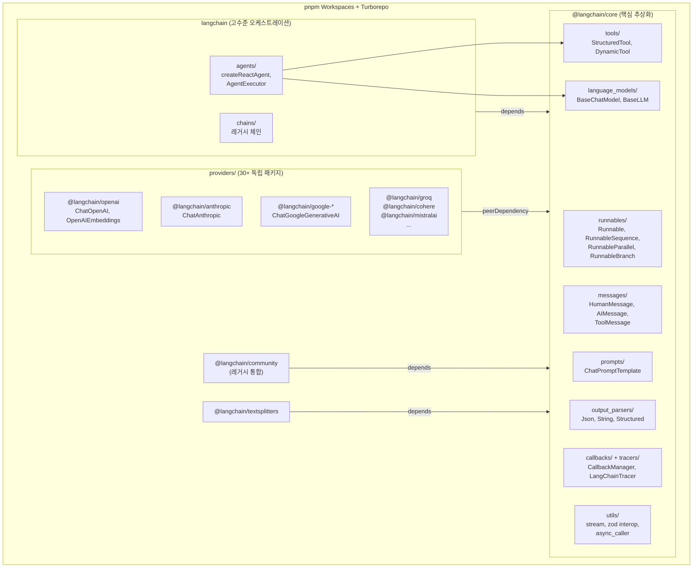
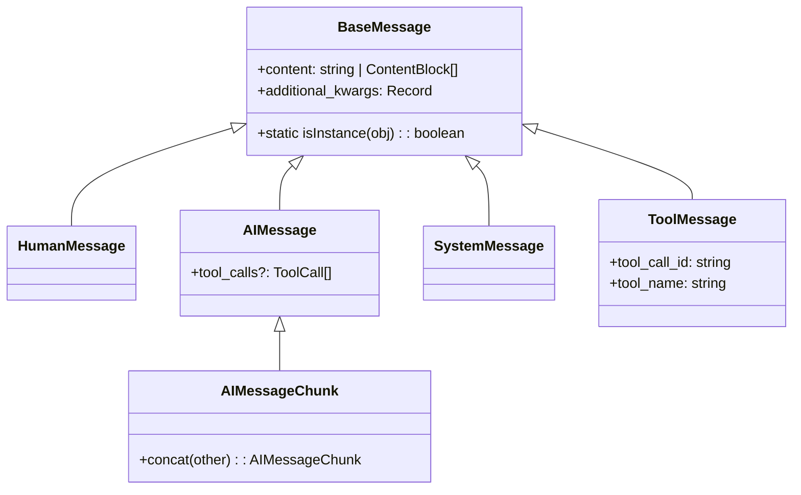
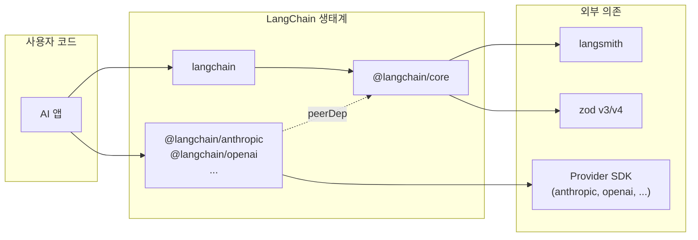

# LangChain.js — Architecture

## 모듈 구조



## 계층 아키텍처

```
┌──────────────────────────────────────────────┐
│  langchain (고수준)                            │
│  createReactAgent, AgentExecutor              │
│  Agent middleware system                       │
├──────────────────────────────────────────────┤
│  @langchain/core (추상화 계층)                 │
│  Runnable interface: invoke/stream/batch      │
│  Messages, Tools, Prompts, OutputParsers      │
│  Callbacks, Tracers, Config management        │
├──────────────────────────────────────────────┤
│  @langchain/openai  │  @langchain/anthropic   │
│  @langchain/google  │  @langchain/groq  ...   │
│  (각 provider가 BaseChatModel 등을 확장)       │
├──────────────────────────────────────────────┤
│  langsmith SDK (관찰성 기반)                   │
└──────────────────────────────────────────────┘
```

## 설계 패턴 분석

### 1. Composition Pattern — 상속 대신 조합

거의 모든 기능이 Runnable의 `pipe()` 조합으로 구현된다.

**`libs/langchain-core/src/runnables/base.ts`**:

```typescript
// pipe()는 RunnableSequence를 생성
pipe<NewRunOutput>(coerceable: RunnableLike<RunOutput, NewRunOutput>): Runnable {
  return new RunnableSequence({
    first: this,
    last: _coerceToRunnable(coerceable),
  });
}
```

**조합 클래스 체계**:

| 클래스 | 역할 | 사용 패턴 |
|--------|------|-----------|
| `RunnableSequence` | 순차 실행 (A→B→C) | `a.pipe(b).pipe(c)` |
| `RunnableParallel` | 병렬 실행 | `RunnableParallel({ a, b })` |
| `RunnableBranch` | 조건부 라우팅 | `RunnableBranch([cond1, r1], default)` |
| `RunnableLambda` | 함수→Runnable 래핑 | `RunnableLambda(fn)` |
| `RunnableRetry` | 재시도 로직 | `.withRetry({ stopAfterAttempt: 3 })` |
| `RunnableWithFallbacks` | Fallback chain | `.withFallbacks([fallback])` |
| `RunnableAssign` | 필드 추가 | `.assign({ newField: runnable })` |
| `RunnablePick` | 필드 선택 | `.pick(["field1", "field2"])` |

**LCEL 표현력 예시**:

```typescript
// 복잡한 워크플로우를 선언적으로 표현
const chain = RunnableParallel({
  summary: prompt1.pipe(model).pipe(parser),
  keywords: prompt2.pipe(model).pipe(keywordParser),
  sentiment: prompt3.pipe(model).pipe(sentimentParser),
}).pipe(combineResults);
```

### 2. Provider Integration Pattern — 표준화된 확장

모든 LLM provider가 동일 패턴으로 통합된다.

**표준 provider 패키지 구조**:

```
@langchain/anthropic/
├── package.json
│   peerDependencies: { "@langchain/core": "~0.3.0" }
│   dependencies: { "@anthropic-ai/sdk": "^0.39.0" }
├── src/
│   ├── chat_models.ts   ← ChatAnthropic extends BaseChatModel
│   ├── embeddings.ts    ← (있는 경우)
│   └── index.ts         ← 공개 API
└── tests/
```

**구현해야 하는 핵심 메서드**:

```typescript
class ChatAnthropic extends BaseChatModel<ChatAnthropicCallOptions> {
  // 필수: 단일 호출
  async _generate(
    messages: BaseMessage[],
    options: this["ParsedCallOptions"],
    runManager?: CallbackManagerForChainRun
  ): Promise<ChatResult> { ... }

  // 선택: 스트리밍 (구현하면 stream()이 자동으로 활용)
  async *_streamResponseChunks(
    messages: BaseMessage[],
    options: this["ParsedCallOptions"],
    runManager?: CallbackManagerForChainRun
  ): AsyncGenerator<ChatGenerationChunk> { ... }

  // 선택: Tool binding
  bindTools(tools: BindToolsInput[]): Runnable { ... }
}
```

**설계 의도**: provider 개발자가 `_generate`와 `_streamResponseChunks`만 구현하면 invoke/stream/batch/transform이 모두 자동으로 동작한다.

### 3. Message Type Hierarchy



**설계 결정**: `instanceof` 대신 `static isInstance()` 메서드 사용. 직렬화/역직렬화 후에도 타입 검증이 안전하게 동작한다.

### 4. Config Management — 계층적 설정 전파

**`libs/langchain-core/src/runnables/config.ts`**:

```typescript
// 설정 병합: 기본값 + 런타임 오버라이드
function mergeConfigs<T extends RunnableConfig>(left?: T, right?: T): RunnableConfig {
  // right이 left를 override
}

// 설정 전파: 부모 → 자식
function patchConfig<T extends RunnableConfig>(config: T, patch: Partial<T>): T {
  // 특정 키만 패치 (callbacks, tags, metadata)
}
```

**전파 항목**: runId, tags, metadata, callbacks, recursionLimit, maxConcurrency

**AsyncLocalStorage 통합** (`libs/langchain-core/src/singletons/`):

```typescript
export class AsyncLocalStorageProviderSingleton {
  private static instance: AsyncLocalStorage<...>;
  // Node.js, Deno, Workers 모두 지원
  // 콜백 컨텍스트를 async 경계를 넘어 자동 전파
}
```

### 5. Dual Build Strategy — ESM/CJS 양쪽 지원

**`libs/langchain-core/package.json`**:

```json
"exports": {
  ".": {
    "input": "./src/index.ts",
    "require": {
      "types": "./dist/index.d.cts",
      "default": "./dist/index.cjs"
    },
    "import": {
      "types": "./dist/index.d.ts",
      "default": "./dist/index.js"
    }
  },
  "./runnables": { ... },
  "./messages": { ... }
}
```

**설계 의도**:
- Subpath exports로 각 모듈을 독립 진입점으로 제공 → tree-shaking 효율화
- ESM/CJS 각각에 대해 타입 정의와 런타임 코드를 분리 제공
- `tsdown`으로 단일 소스에서 양쪽 빌드 생성

### 6. Zod Interop Layer

**`libs/langchain-core/src/utils/types/zod.ts`** (~1,028줄):

```typescript
// v3와 v4를 통합하는 타입
export type InteropZodType = ZodTypeV3 | ZodTypeV4;

// 런타임에 버전 감지하여 적절한 parse 호출
export async function interopParseAsync(
  schema: InteropZodType, input: unknown
): Promise<...> {
  // Zod v3: schema.parseAsync(input)
  // Zod v4: z4.parseAsync(schema, input)
}

// 에러 처리도 버전별로 분기
export function isInteropZodError(e: unknown): boolean { ... }
```

**트레이드오프**: 1,000줄의 interop 코드 유지 비용을 감수하면서 사용자의 Zod 버전 자유를 보장한다.

---

## 의존 관계 요약



**핵심 원칙**: 의존성이 항상 상위 → Core → 외부 방향으로 흐른다. Provider는 Core에 의존하되 peerDependency로 버전 일관성을 보장한다.

---

## 배울 점

1. **Monorepo + peerDependency 전략**: 30+ 패키지가 하나의 core를 peerDependency로 공유하여 타입 불일치 없이 독립 배포/업데이트 가능. Turborepo로 빌드 효율화
2. **Subpath Exports로 tree-shaking**: `@langchain/core/runnables`, `@langchain/core/messages` 등 세분화된 진입점으로 번들 크기 최적화
3. **"_generate만 구현하면 모든 것이 동작"**: 추상 클래스의 핵심 메서드만 구현하면 invoke/stream/batch/transform이 자동 동작하는 설계. 확장 비용 최소화
4. **isInstance() > instanceof**: 직렬화 안전한 타입 검증 패턴. 네트워크 경계를 넘는 데이터에서도 타입 검증이 동작

## 적용 아이디어

| LangChain.js 아키텍처 | EDR AI 적용 |
|----------------------|-------------|
| Monorepo + peerDep | `@edr/ai-core`를 중심으로 `@edr/ai-detection`, `@edr/ai-response` 등을 독립 패키지로 분리하되 core를 peerDep으로 통일 |
| Provider 확장 패턴 | LLM provider를 `BaseLLMProvider._generate()`만 구현하면 되는 표준 패턴으로 정의. Claude, GPT, 로컬 LLM 교체 용이 |
| Subpath Exports | AI 기능 모듈을 `@edr/ai/detection`, `@edr/ai/response` 등 세분화하여 필요한 것만 import |
| Composition Pattern | 보안 분석 파이프라인을 `eventParser.pipe(classifier).pipe(scorer).pipe(recommender)` 로 선언적 구성 |
| Config 전파 | 분석 설정(민감도, 모델, 프롬프트)을 계층적으로 전파 — 전역 기본값 → 기능별 → 요청별 오버라이드 |
| isInstance() 패턴 | API 경계를 넘는 AI 분석 결과 객체의 타입 검증에 static 메서드 사용 |
