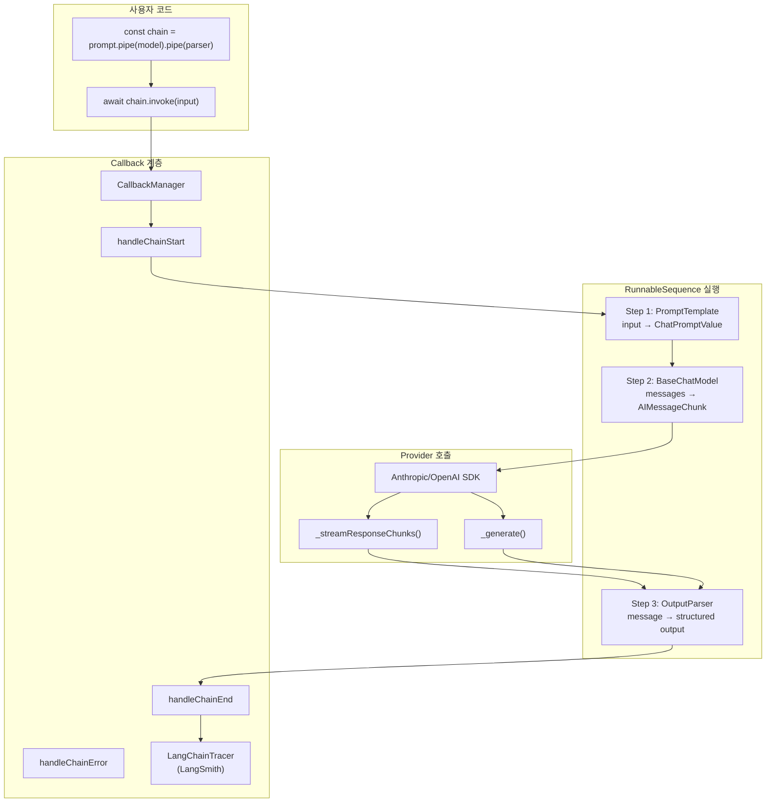
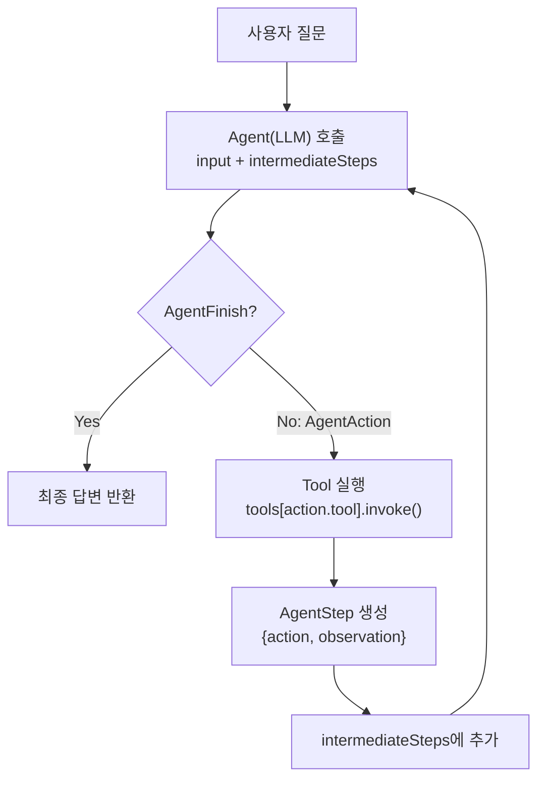
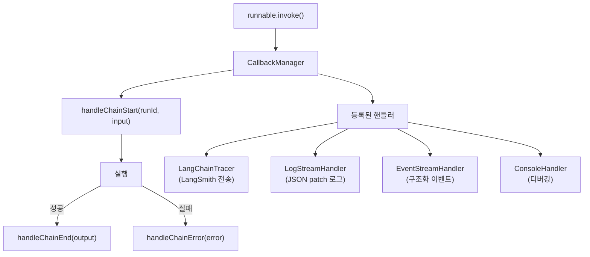

# LangChain.js — Core Logic

## 전체 실행 흐름



## 핵심 알고리즘/패턴 상세 분석

### 1. Runnable Interface — 4방향 실행 프로토콜

모든 컴포넌트의 기초가 되는 추상 클래스다. 4가지 실행 패턴을 정의한다.

**`libs/langchain-core/src/runnables/types.ts:23-63`**:

```typescript
export interface RunnableInterface<
  RunInput = any,
  RunOutput = any,
  CallOptions extends RunnableConfig = RunnableConfig
> {
  invoke(input: RunInput, options?: Partial<CallOptions>): Promise<RunOutput>;
  batch(inputs: RunInput[], options?: ...): Promise<RunOutput[]>;
  stream(input: RunInput, options?: ...): Promise<IterableReadableStreamInterface<RunOutput>>;
  transform(generator: AsyncGenerator<RunInput>, options: ...): AsyncGenerator<RunOutput>;
}
```

**4방향 대칭성의 의미**:
- `invoke`: 1:1 — 단일 입력에 단일 출력
- `batch`: N:N — 병렬 처리 (AsyncCaller로 동시성 제어)
- `stream`: 1:M — 실시간 청크 스트리밍
- `transform`: N:M — AsyncGenerator 파이프라인 (스트리밍 체인의 핵심)

### 2. invoke() 실행 흐름 — 콜백 통합

**`libs/langchain-core/src/runnables/base.ts:359-392`**:

```typescript
protected async _callWithConfig<T extends RunInput>(
  func: (input: T, config?: ..., runManager?: ...) => Promise<RunOutput>,
  input: T,
  options?: Partial<CallOptions>
) {
  const config = ensureConfig(options);
  const callbackManager_ = await getCallbackManagerForConfig(config);

  // 1. Run 시작: on_chain_start
  const runManager = await callbackManager_?.handleChainStart(
    this.toJSON(), _coerceToDict(input, "input"),
    config.runId, config?.runType
  );

  let output;
  try {
    // 2. 함수 실행 + AbortSignal로 취소/타임아웃 지원
    const promise = func.call(this, input, config, runManager);
    output = await raceWithSignal(promise, options?.signal);
  } catch (e) {
    // 3. 에러: on_chain_error
    await runManager?.handleChainError(e);
    throw e;
  }

  // 4. 성공: on_chain_end
  await runManager?.handleChainEnd(_coerceToDict(output, "output"));
  return output;
}
```

**핵심**: 모든 Runnable의 invoke가 자동으로 콜백 라이프사이클(시작→실행→완료/에러)을 관리한다.

### 3. RunnableSequence — LCEL 파이프라인의 실체

`prompt.pipe(model).pipe(parser)` 호출 시 생성되는 핵심 클래스다.

**`libs/langchain-core/src/runnables/base.ts:1847-1930`**:

```typescript
export class RunnableSequence<RunInput = any, RunOutput = any>
  extends Runnable<RunInput, RunOutput> {

  protected first: Runnable<RunInput>;
  protected middle: Runnable[] = [];
  protected last: Runnable<any, RunOutput>;

  async invoke(input: RunInput, options?: RunnableConfig): Promise<RunOutput> {
    let nextStepInput = input;

    // first + middle: 순차 실행
    const initialSteps = [this.first, ...this.middle];
    for (let i = 0; i < initialSteps.length; i++) {
      nextStepInput = await initialSteps[i].invoke(
        nextStepInput,
        patchConfig(config, {
          callbacks: runManager?.getChild(`seq:step:${i + 1}`),
        })
      );
    }

    // last: 최종 단계
    return await this.last.invoke(nextStepInput, patchConfig(config, {
      callbacks: runManager?.getChild(`seq:step:${this.steps.length}`),
    }));
  }
}
```

**스트리밍 체인 동작** — `_streamIterator`:

```typescript
async *_streamIterator(input: RunInput, options?: RunnableConfig) {
  const steps = [this.first, ...this.middle, this.last];

  // 첫 단계 → transform으로 시작
  let finalGenerator = steps[0].transform(inputGenerator(), ...);

  // 나머지 단계: 이전 단계의 output을 다음 단계의 input으로 연결
  for (let i = 1; i < steps.length; i++) {
    finalGenerator = await steps[i].transform(finalGenerator, ...);
  }

  // 최종 청크 yield
  for await (const chunk of finalGenerator) {
    yield chunk;
  }
}
```

**핵심**: `transform()`으로 AsyncGenerator를 연쇄하여 각 단계가 이전 단계의 스트리밍 출력을 실시간으로 처리한다.

### 4. batch() — 동시성 제어된 병렬 처리

**`libs/langchain-core/src/runnables/base.ts:261-289`**:

```typescript
async batch(inputs: RunInput[], options?: ..., batchOptions?: ...): Promise<(RunOutput | Error)[]> {
  const configList = this._getOptionsList(options ?? {}, inputs.length);
  const maxConcurrency = configList[0]?.maxConcurrency;

  // AsyncCaller: 동시성 제한 + 재시도
  const caller = new AsyncCaller({ maxConcurrency });

  const batchCalls = inputs.map((input, i) =>
    caller.call(async () => {
      try {
        return await this.invoke(input, configList[i]);
      } catch (e) {
        if (batchOptions?.returnExceptions) return e as Error;
        throw e;
      }
    })
  );

  return Promise.all(batchCalls);
}
```

**설계**: `returnExceptions` 옵션으로 부분 실패를 허용하여 전체 배치가 하나의 실패로 중단되지 않게 한다.

### 5. Agent 루프 — 도구 호출 반복

에이전트가 LLM과 도구를 반복적으로 호출하는 핵심 루프다.



**`libs/langchain-classic/src/agents/executor.ts:126-154`**:

```typescript
async *streamIterator() {
  this.reset();
  while (true) {
    try {
      if (this.iterations === 0) await this.onFirstStep();
      const result = await this._callNext();
      yield result;  // 중간 결과 스트리밍
    } catch (e: any) {
      if (e.message.startsWith("Final outputs already reached: ")) {
        return this.finalOutputs;  // 루프 종료
      }
      throw e;
    }
  }
}
```

**AgentStep 구조** (`libs/langchain-core/src/agents.ts`):

```typescript
export type AgentAction = {
  tool: string;                          // 도구 이름
  toolInput: string | Record<string, any>; // 도구 입력
  log: string;                           // LLM의 추론 로그
};

export type AgentStep = {
  action: AgentAction;
  observation: string;  // 도구 실행 결과
};
```

### 6. Tool 실행 — Zod 스키마 검증

**`libs/langchain-core/src/tools/index.ts:230-248`**:

```typescript
// Tool 입력 검증
if (isInteropZodSchema(this.schema)) {
  try {
    parsed = await interopParseAsync(
      this.schema as InteropZodType,
      inputForValidation
    );
  } catch (e) {
    let message = `Received tool input did not match expected schema`;
    if (this.verboseParsingErrors) {
      message += `\nDetails: ${e.message}`;
    }
    throw new ToolInputParsingException(message, JSON.stringify(arg));
  }
}
```

**ToolInputParsingException 설계**: 원본 입력을 보존하여 에이전트가 이전 시도에서 학습하고 재시도할 수 있게 한다.

### 7. BaseChatModel — LLM 추상화

**`libs/langchain-core/src/language_models/chat_models.ts:207-240`**:

```typescript
export abstract class BaseChatModel<
  CallOptions extends BaseChatModelCallOptions,
  OutputMessageType extends BaseMessageChunk = AIMessageChunk
> extends BaseLanguageModel<OutputMessageType, CallOptions> {

  async invoke(input: BaseLanguageModelInput, options?: ...): Promise<OutputMessageType> {
    const promptValue = BaseChatModel._convertInputToPromptValue(input);
    const result = await this.generatePrompt([promptValue], options);
    return result.generations[0][0].message as OutputMessageType;
  }

  // 서브클래스가 구현하는 핵심 메서드
  abstract _generate(messages: BaseMessage[], options: ...): Promise<ChatResult>;

  // 스트리밍 (선택적 오버라이드)
  async *_streamResponseChunks(messages: BaseMessage[], options: ...):
    AsyncGenerator<ChatGenerationChunk> {
    throw new Error("Not implemented.");
  }

  // Tool binding (선택적)
  bindTools?(tools: BindToolsInput[], kwargs?: ...): Runnable;
}
```

**Provider 구현 예시** — ChatAnthropic의 tool 변환 (`libs/providers/langchain-anthropic/src/chat_models.ts:1080-1100`):

```typescript
formatStructuredToolToAnthropic(tools): Anthropic.Messages.ToolUnion[] {
  return tools.map((tool) => {
    if (isLangChainTool(tool) && tool.extras?.providerToolDefinition) {
      return tool.extras.providerToolDefinition;
    }
    // LangChain Tool → Anthropic format 변환
  });
}
```

### 8. Stream Processing — IterableReadableStream

**`libs/langchain-core/src/utils/stream.ts`**:

```typescript
export class IterableReadableStream<T>
  extends ReadableStream<T>
  implements IterableReadableStreamInterface<T> {

  async next(): Promise<IteratorResult<T>> { ... }
  [Symbol.asyncIterator]() { return this; }
  async [Symbol.asyncDispose]() { ... }  // Node 22+ 리소스 정리
}
```

**이중 인터페이스**: ReadableStream(Web API 호환)과 AsyncIterator(`for await...of`) 동시 지원. 플랫폼(Node, Browser, Workers) 무관하게 동일 패턴 사용.

### 9. Callback 계층 — 관찰성의 핵심



**Run 생명주기** (`libs/langchain-core/src/tracers/base.ts:42-54`):

```typescript
interface Run {
  id: string;
  start_time: number;
  end_time?: number;
  execution_order: number;
  child_runs: Run[];       // 중첩 실행 추적
  parent_run_id?: string;  // 부모-자식 관계
  dotted_order?: string;   // 트레이싱용 정렬 키
}
```

**Config 전파**: `patchConfig()`로 각 RunnableSequence 단계마다 `seq:step:N` 태그를 자동 부여하여 계층적 트레이싱을 구현한다.

---

## 배울 점

1. **4방향 실행 프로토콜**: invoke/stream/batch/transform을 모든 컴포넌트에 강제하여, 어떤 조합이든 스트리밍과 병렬 처리가 자동으로 동작. 특히 `transform()`이 스트리밍 체인의 핵심 연결고리
2. **AsyncGenerator 체이닝**: `_streamIterator`에서 각 단계의 `transform()`을 연쇄하여 실시간 스트리밍 파이프라인 구성. 메모리 효율적이며 첫 청크까지의 시간(TTFB) 최소화
3. **ToolInputParsingException의 학습 가능성**: 검증 실패 시 원본 입력을 보존하여 에이전트가 이전 시도의 오류를 학습하고 수정된 입력으로 재시도 가능
4. **콜백의 계층적 자동 전파**: `patchConfig`와 `getChild()`로 콜백 컨텍스트를 자동 전파하여, 명시적 추적 코드 없이 전체 실행 트리를 재구성 가능

## 적용 아이디어

| LangChain.js 패턴 | EDR AI 적용 |
|-------------------|-------------|
| Runnable 4방향 프로토콜 | AI 분석 모듈(탐지, 분류, 요약)에 invoke/stream/batch를 통일하여 단일 이벤트/대량 배치/실시간 모니터링 지원 |
| LCEL 파이프라인 | `이벤트전처리.pipe(위협분류).pipe(심각도평가).pipe(대응추천)` 같은 선언적 분석 체인 |
| Agent 루프 | 보안 이벤트 분석 에이전트가 도구(WHOIS조회, IP평판조회, 패턴매칭)를 반복 호출하며 점진적으로 위협 판단 |
| AsyncCaller 동시성 | 대량 보안 이벤트 분석 시 maxConcurrency로 LLM API 동시 호출 수를 제어하여 안정성 확보 |
| 콜백 계층 추적 | AI 판단 과정을 계층적으로 기록하여 "왜 이 이벤트를 위협으로 판단했는가"의 감사 추적 자동화 |
